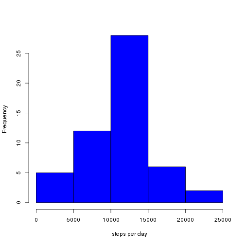
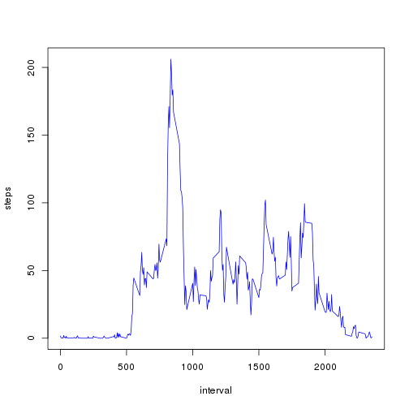
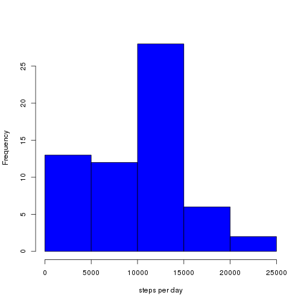
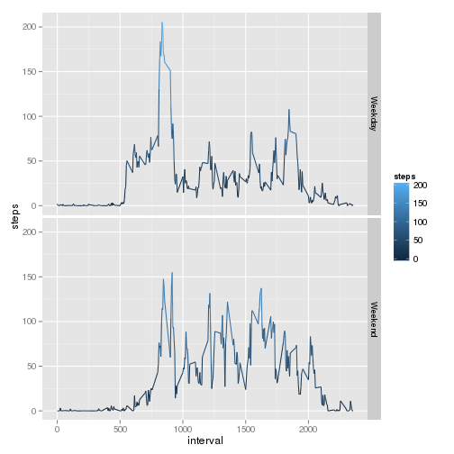

# Reproducible Research: Peer Assessment 1

## Loading and preprocessing the data
Read the data from the zip file
Process the data to create a data.table for future operations

```r
library(data.table)
data <- read.csv(unz("activity.zip", "activity.csv"), header = TRUE, sep = ",")
dataTable <- data.table(data)
dataTable$date <- as.Date(dataTable$date)
```


## What is mean total number of steps taken per day?

1. Make a histogram of the total number of steps taken each day

```r
dataSumByDate <- dataTable[, lapply(.SD, sum), by = date]
hist(dataSumByDate$steps, col = "blue", xlab = "steps per day", main = "")
```

 

2. Calculate and report the mean and median total number of steps taken per day

```r
mean(dataSumByDate$steps, na.rm = TRUE)
```

```
## [1] 10766
```

```r
median(dataSumByDate$steps, na.rm = TRUE)
```

```
## [1] 10765
```


## What is the average daily activity pattern?
1. Make a time series plot (i.e. type = "l") of the 5-minute interval (x-axis) and the average number of steps taken, averaged across all days (y-axis)

```r
dataAvgByInterval <- dataTable[, lapply(.SD, mean, na.rm = TRUE), by = interval, 
    ]
plot(steps ~ interval, data = dataAvgByInterval, type = "l", col = "blue")
```

 


2. Which 5-minute interval, on average across all the days in the dataset, contains the maximum number of steps?


```r
dataAvgByInterval[dataAvgByInterval$steps == max(dataAvgByInterval$steps), ]$interval
```

```
## [1] 835
```


## Imputing missing values
1.Calculate and report the total number of missing values in the dataset (i.e. the total number of rows with NAs)

```r
nrow(dataTable[!complete.cases(dataTable$steps), ])
```

```
## [1] 2304
```

2. Devise a strategy for filling in all of the missing values in the dataset. The strategy does not need to be sophisticated. For example, you could use the mean/median for that day, or the mean for that 5-minute interval, etc.
3. Create a new dataset that is equal to the original dataset but with the missing data filled in.

The strategy adopted here is to fill the missing values with median for that interval

```r
imputeDataTable <- dataTable
imputeDataTable[, `:=`(steps, ifelse(is.na(steps), median(steps, na.rm = TRUE), 
    steps)), by = interval]
```

```
##        steps       date interval
##     1:     0 2012-10-01        0
##     2:     0 2012-10-01        5
##     3:     0 2012-10-01       10
##     4:     0 2012-10-01       15
##     5:     0 2012-10-01       20
##    ---                          
## 17564:     0 2012-11-30     2335
## 17565:     0 2012-11-30     2340
## 17566:     0 2012-11-30     2345
## 17567:     0 2012-11-30     2350
## 17568:     0 2012-11-30     2355
```


4.Make a histogram of the total number of steps taken each day and Calculate and report the mean and median total number of steps taken per day. Do these values differ from the estimates from the first part of the assignment? What is the impact of imputing missing data on the estimates of the total daily number of steps?

```r
imputeDataSumByDate <- imputeDataTable[, lapply(.SD, sum), by = date]
hist(imputeDataSumByDate$steps, col = "blue", xlab = "steps per day", main = "")
```

 

```r
mean(imputeDataSumByDate$steps)
```

```
## [1] 9504
```

```r
median(imputeDataSumByDate$steps)
```

```
## [1] 10395
```

The values of mean and median shall differ from the original.
The impact is such that mean and median are lower than the original.

## Are there differences in activity patterns between weekdays and weekends?
1.Create a new factor variable in the dataset with two levels – “weekday” and “weekend” indicating whether a given date is a weekday or weekend day.

```r
imputeDataTable <- cbind(imputeDataTable, week = weekdays(imputeDataTable$date))
imputeDataTable$week <- as.factor(ifelse(imputeDataTable$week %in% c("Saturday", 
    "Sunday"), "Weekend", "Weekday"))
```


2.Make a panel plot containing a time series plot (i.e. type = "l") of the 5-minute interval (x-axis) and the average number of steps taken, averaged across all weekday days or weekend days (y-axis). 

```r
library(ggplot2)
data_mod <- imputeDataTable[, lapply(.SD, mean), by = list(interval, week)]
qplot(interval, steps, data = data_mod, facets = week ~ ., geom = "line", colour = steps)
```

 

